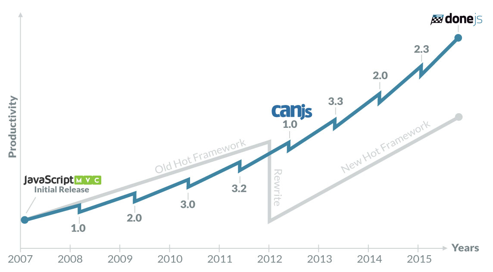

title: DoneJS - Your app. Done.
output: index.html
theme: theme
controls: false
logo: theme/logo.png
style: style.css

-- centered hero


# VanJS, January 18, 2016

-- color dark-grey hero centered
<div style="margin-top:3em">
<h1>Performance</h1>
<h1>Maintainability</h1>
<h1>Usability</h1>
</div>

-- color light-grey hero

## <small>Better</small> Performance

- _Server Side Rendered (Isomorphic)_
- Progressive Loading
- Minimal Data Requests
- Minimal DOM Updates
- Worker Thread Rendering
- Deploy to a CDN

-- color blue hero

## <small>More</small> Maintainable

- Comprehensive Testing
- Documentation
- Continuous Integration & Deployment
- _NPM Packages_
- ES6 Modules
- Modlets
- Custom HTML Elements
- MVVM Architecture
- _Hot Module Swapping_
- Generators

-- color dark-grey hero

## <small>Improved App</small> Usability

- _Real Time_
- Two-way Routing
- IE8+
- _iOS, Android_
- _Desktop_


-- centered

## With a History


--

- Open Source JavaScript framework (MIT)
- Backend services agnostic
- Windows, Linux, OSX
- Comes with
  - [StealJS](http://stealjs.com) - ES6, CJS, and AMD module loader and builder
  - [CanJS](http://canjs.com) - Custom elements and Model-View-ViewModel utilities
  - [jQuery](http://jquery.com) - DOM helpers
  - [FuncUnit](http://funcunit.com) - Functional tests
  - [Testee](https://github.com/bitovi/testee) - QUnit, Mocha and Jasmine Test runner
  - [DocumentJS](http://documentjs.com) - Documentation
  - [can-ssr](http://github.com/canjs/ssr) - Server-Side Rendering Utilities for CanJS
  - [can-connect](https://github.com/canjs/can-connect) - Assemble real-time, high performance, restful data connections.

--

## Getting Started


> npm install donejs -g

> donejs init donejs-chat

--

## NPM and Hot-Module Swapping

> npm install bootstrap --save

```html
<can-import from="bootstrap/less/bootstrap.less!" />
<can-import from="donejs-chat/styles.less!" />
<can-import from="donejs-chat/app" export-as="viewModel" />

<div class="container">
  <div class="row">
    <div class="col-sm-8 col-sm-offset-2">
      <h1 class="page-header text-center">
        
        <br>Chat
      </h1>
    </div>
  </div>
</div>
```

-- centered

## Server Side Rendering


--

## Real-time

> npm install steal-socket.io --save

```javascript
import io from 'steal-socket.io';

const socket = io('http://chat.donejs.com');

socket.on('messages created',
  message => messageConnection.createInstance(message));
socket.on('messages updated',
  message => messageConnection.updateInstance(message));
socket.on('messages removed',
  message => messageConnection.destroyInstance(message));
```

--

## Desktop and Mobile Builds


#### iOS/Android (Cordova)

> donejs add cordova

> donejs build cordova

#### Desktop (nw.js)

> donejs add nw

> donejs build nw

-- centered

## Why is History Important?



<small>Source: <em>[Longevity (or Lack Thereof) in JavaScript Frameworks](http://blog.bitovi.com/longevity-or-lack-thereof-in-javascript-frameworks/)</em></small>

-- hero color blue wide-list

## How Do We Do It?

- It's our business model
 - Building amazing applications for our clients<br> using our tools!
- Enterprise Clients
 - Want long term stability and reliability
- Hard work and persistence


-- hero color dark-grey wide-list

## Real Talk: Its Not Been Easy

- Documentation is hard
 - Empathizing with our users has been a weak point
 - Explaining _why_ not just _how_
- Being old and cool is hard
 - We don't look _cool_
 - We have a small team and small budget for marketing
- We have to market to our clients, which is different than marketing to developers

-- hero color blue wide-list

## Rallying the JS Community

- Selling the whole pie is harder than just a slice
- Getting the attention of passionate early adopters is essential


-- presenter hero color dark-grey wide-list
## The End.
<div>
<div class="bio">


<h2>Julia Allyce</h2>
<ul>
  <li>[<i class="fa fa-github"></i> julia-allyce](https://github.com/julia-allyce)</li>
  <li>[<i class="fa fa-twitter"></i> @julia_allyce](http://twitter.com/julia_allyce)</li>
</ul>
</div>

<div class="bio">


<h2>David Luecke</h2>
<ul>
  <li>[<i class="fa fa-github"></i> daffl](https://github.com/daffl)</li>
  <li>[<i class="fa fa-twitter"></i> @daffl](http://twitter.com/daffl)</li>
</ul>
</div>
</div>

<h2 style="margin-top: 1em;">[http://julia-allyce.github.io/vanjs-donejs/](http://julia-allyce.github.io/vanjs-donejs/)</h2>
