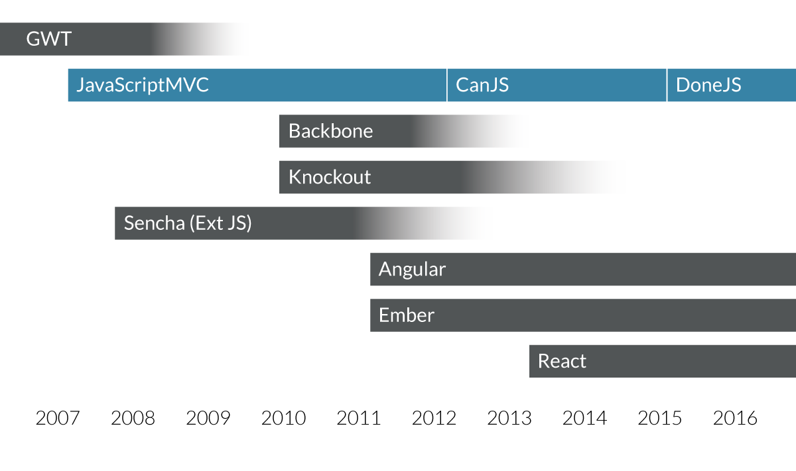
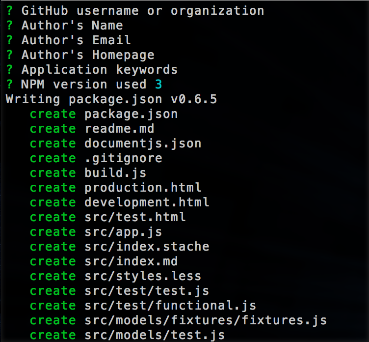
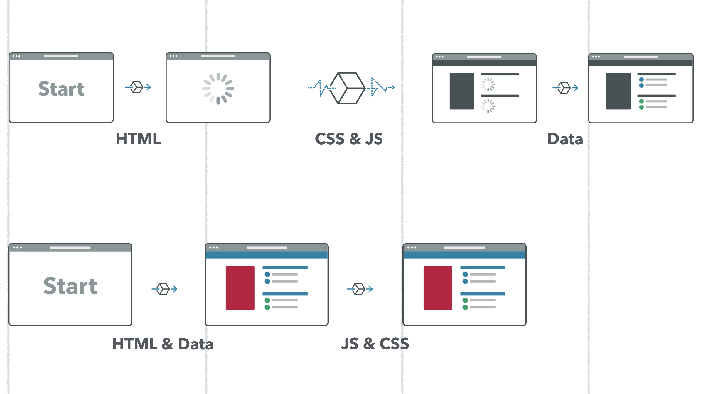

title: DoneJS - Get your app done
output: index.html
theme: theme
controls: false
logo: theme/logo.png
style: style.css

-- centered


--

## So what is it?

- Open Source JavaScript framework (MIT)
- Backend services agnostic
- Windows, Linux, OSX
- Comes with
  - [StealJS](http://stealjs.com) - ES6, CJS, and AMD module loader and builder
  - [CanJS](http://canjs.com) - Custom elements and Model-View-ViewModel utilities
  - [jQuery](http://jquery.com) - DOM helpers
  - [FuncUnit](http://funcunit.com) - Functional tests
  - [Testee](https://github.com/bitovi/testee) - QUnit, Mocha and Jasmine Test runner
  - [DocumentJS](http://documentjs.com) - Documentation
  - [can-ssr](http://github.com/canjs/ssr) - Server-Side Rendering Utilities for CanJS
  - [can-connect](https://github.com/canjs/can-connect) - Assemble real-time, high performance, restful data connections.

-- centered

## With a History



--

## Performance

- Server Side Rendering
- Progressive Loading
- Data Caching
- Minimal DOM Updates
- Worker Rendering
- CDN Deploys

--

## Maintainability

- Comprehensive Testing
- Hot Module Swapping
- CI & CD
- ES6 Modules
- NPM Packages
- Modlets
- Custom Elements
- MVVM
- Generators

--

## Usability

- Real Time
- Two-way Routing
- IE8+
- iOS, Android
- Desktop

--

## Getting started



> npm install donejs -g

> donejs init donejs-chat

--

## NPM and hot-module swapping

> npm install bootstrap --save

```html
<can-import from="bootstrap/less/bootstrap.less!" />
<can-import from="donejs-chat/styles.less!" />
<can-import from="donejs-chat/app" export-as="viewModel" />

<div class="container">
  <div class="row">
    <div class="col-sm-8 col-sm-offset-2">
      <h1 class="page-header text-center">
        
        <br>Chat
      </h1>
    </div>
  </div>
</div>
```

-- centered

## Server side Rendering



--

## Components

> donejs add component home.component chat-home

```html
<can-component tag="chat-home">
  <style type="less">
    display: block;
    h1.page-header { margin-top: 0; }
  </style>
  <template>
    <h1 class="page-header text-center">
      
      <br>Chat
    </h1>

    <a href="{{routeUrl page='chat' }}" class="btn btn-primary btn-block btn-lg">
      Start chat
    </a>
  </template>
</can-component>
```

--

## Routing

> donejs add component messages chat-messages

```html
<!-- messages/messages.stache -->
<h5><a href="{{routeUrl page='home'}}">Home</a></h5>
<p>{{message}}</p>
```

Then in `app.js`:

```javascript
route('/:page', { page: 'home' });
```

--

## Switching between pages

```html
<!-- index.stache -->
<div class="container">
  <div class="row">
    <div class="col-sm-8 col-sm-offset-2">
      {{#eq page 'chat'}}
        <can-import from="donejs-chat/messages/">
          {{#if isPending}}Loading...{{else}}<chat-messages/>{{/if}}
        </can-import>
      {{else}}
        <can-import from="donejs-chat/home.component!">
          {{#if isPending}}Loading...{{else}}<chat-home/>{{/if}}
        </can-import>
      {{/eq}}
    </div>
  </div>
</div>
```

--

## Finishing the homepage

> npm install bit-tabs --save

```html
<!-- home.component -->
<template>
  ...
  <can-import from="bit-tabs/unstyled" />

  <bit-tabs tabs-class="nav nav-tabs">
    <bit-panel title="CanJS">
      <p>CanJS provides the MV*</p>
    </bit-panel>
    <bit-panel title="StealJS">
      <p>StealJS provides the infrastructure.</p>
    </bit-panel>
  </bit-tabs>
</template>
```

-- centered

## You're still here? We still have time?

#### Production builds
#### Desktop and mobile apps
#### Testing
#### CDN deploy
#### donejs-react
#### Sam again

-- presenter


## David Luecke

* [<i class="fa fa-github"></i> daffl](https://github.com/daffl)
* [<i class="fa fa-twitter"></i> @daffl](http://twitter.com/daffl)
