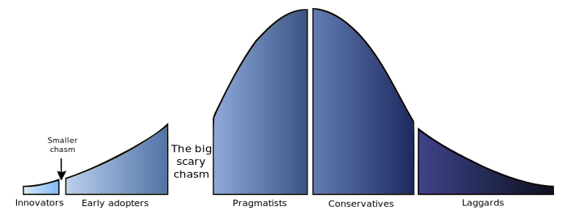

title: DoneJS - Your app. Done.
output: index.html
theme: theme
controls: false
logo: theme/logo.png
style: style.css

-- centered


# VanJS, January 18, 2016

--

## So what is it?

- Open Source JavaScript framework (MIT)
- Backend services agnostic
- Windows, Linux, OSX
- Comes with
  - [StealJS](http://stealjs.com) - ES6, CJS, and AMD module loader and builder
  - [CanJS](http://canjs.com) - Custom elements and Model-View-ViewModel utilities
  - [jQuery](http://jquery.com) - DOM helpers
  - [FuncUnit](http://funcunit.com) - Functional tests
  - [Testee](https://github.com/bitovi/testee) - QUnit, Mocha and Jasmine Test runner
  - [DocumentJS](http://documentjs.com) - Documentation
  - [can-ssr](http://github.com/canjs/ssr) - Server-Side Rendering Utilities for CanJS
  - [can-connect](https://github.com/canjs/can-connect) - Assemble real-time, high performance, restful data connections.

-- centered

## With a History


--

## Performance

- __Server Side Rendering__
- Progressive Loading
- Data Caching
- Minimal DOM Updates
- Worker Rendering
- CDN Deploys

--

## Maintainability

- Comprehensive Testing
- __Hot Module Swapping__
- CI & CD
- ES6 Modules
- __NPM Packages__
- Modlets
- Custom Elements
- MVVM
- Generators

--

## Usability

- __Real Time__
- Two-way Routing
- IE8+
- __iOS, Android__
- __Desktop__

--

## Getting started


> npm install donejs -g

> donejs init donejs-chat

--

## NPM and hot-module swapping

> npm install bootstrap --save

```html
<can-import from="bootstrap/less/bootstrap.less!" />
<can-import from="donejs-chat/styles.less!" />
<can-import from="donejs-chat/app" export-as="viewModel" />

<div class="container">
  <div class="row">
    <div class="col-sm-8 col-sm-offset-2">
      <h1 class="page-header text-center">
        
        <br>Chat
      </h1>
    </div>
  </div>
</div>
```

-- centered

## Server side Rendering


--

## Real-time

> npm install steal-socket.io --save

```javascript
import io from 'steal-socket.io';

const socket = io('http://chat.donejs.com');

socket.on('messages created',
  message => messageConnection.createInstance(message));
socket.on('messages updated',
  message => messageConnection.updateInstance(message));
socket.on('messages removed',
  message => messageConnection.destroyInstance(message));
```

--

## Desktop and mobile builds

#### iOS/Android (Cordova)

> donejs add cordova

> donejs build cordova

#### Desktop (nw.js)

> donejs add nw

> donejs build nw

-- centered

## Why is History Important?


<small>Source: <em>[Longevity (or Lack Thereof) in JavaScript Frameworks](http://blog.bitovi.com/longevity-or-lack-thereof-in-javascript-frameworks/)</em></small>

--

## How Do We Do It?

- It's our business model
- Enterprise Clients
- Hard work and persistence

--

## Real Talk: Its Not Been Easy

- We suck at explaining our tools
- We don't know how to be cool
- OS development is hard, emotionally and mentally

-- centered

## Stuck in the chasm?



[Pete Hunt @ TxJS 2015](https://www.youtube.com/watch?v=A0Kj49z6WdM)

-- centered

## You're still here? We still have time?

#### Testing
#### Production builds
#### CDN deploy
#### Data caching

-- presenter

<div class="bio">


<h2>Julia Allyce</h2>
<ul>
  <li>[<i class="fa fa-github"></i> julia-allyce](https://github.com/julia-allyce)</li>
  <li>[<i class="fa fa-twitter"></i> @julia_allyce](http://twitter.com/julia_allyce)</li>
</ul>
</div>

<div class="bio">


<h2>David Luecke</h2>
<ul>
  <li>[<i class="fa fa-github"></i> daffl](https://github.com/daffl)</li>
  <li>[<i class="fa fa-twitter"></i> @daffl](http://twitter.com/daffl)</li>
</ul>

</div>
